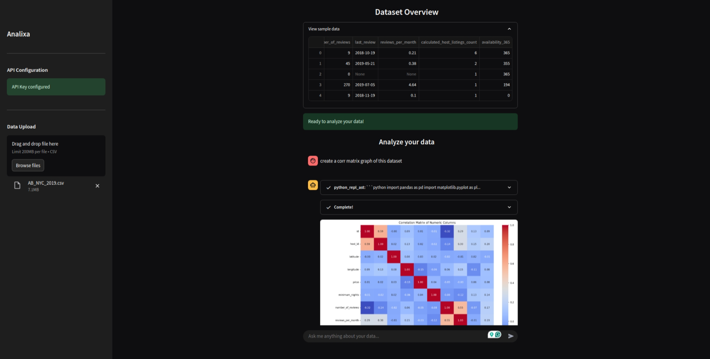
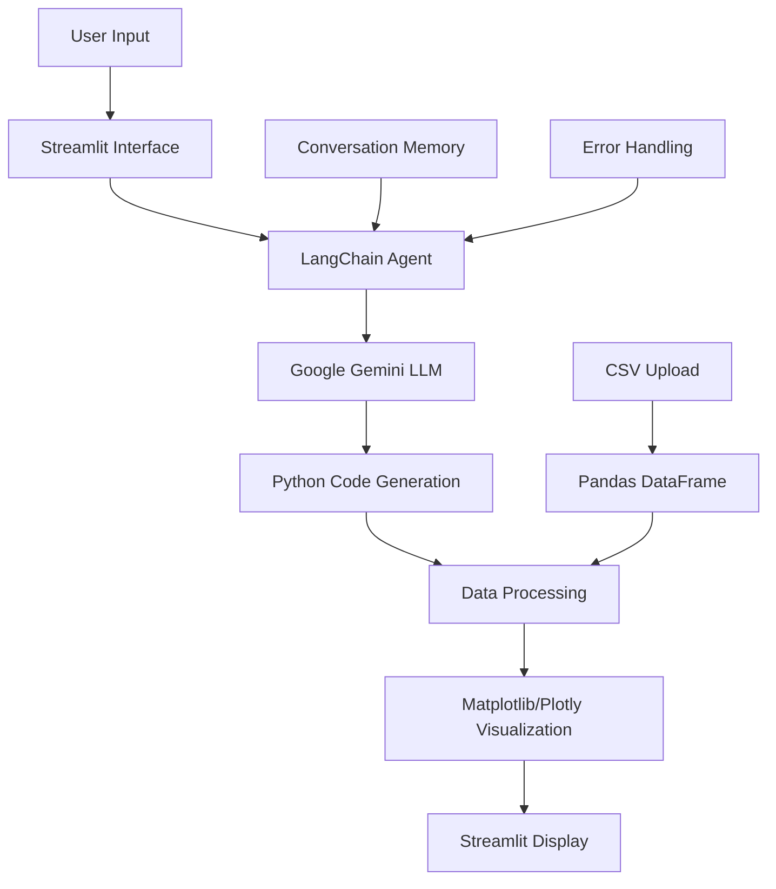

<div align="center">

# 🤖 Analyzia

**Talk to your data. Instantly analyze, visualize, and transform.**

[](https://opensource.org/licenses/MIT)
[](https://www.python.org/downloads/)
[](https://streamlit.io)
[](https://langchain.com)
[](https://ai.google.dev)

---

*Transform your CSV data into meaningful insights with AI-powered analysis and beautiful visualizations*

[🚀 **Get Started**](#-quick-start) • [📖 **Documentation**](#-features) • [🤝 **Contributing**](#-contributing) • [💬 **Support**](#-support)

</div>

## 📋 Table of Contents

- [✨ Features](#-features)
- [🎯 What Makes Analyzia Special](#-what-makes-analyzia-special)
- [🖼️ Screenshots](#️-screenshots)
- [🚀 Quick Start](#-quick-start)
- [⚙️ Installation](#️-installation)
- [🔧 Configuration](#-configuration)
- [📊 Usage Examples](#-usage-examples)
- [🏗️ Architecture](#️-architecture)
- [🛠️ Technology Stack](#️-technology-stack)
- [🤝 Contributing](#-contributing)
- [📄 License](#-license)
- [💬 Support](#-support)
- [🙏 Acknowledgments](#-acknowledgments)

## ✨ Features

<table>
<tr>
<td width="50%">

### 🤖 **AI-Powered Analysis**
- **Natural Language Queries**: Ask questions in plain English
- **Intelligent Data Interpretation**: Understands context and relationships
- **Google Gemini Integration**: Powered by cutting-edge AI

### 📊 **Advanced Visualizations** 
- **Professional Charts**: Beautiful, publication-ready plots
- **Interactive Dashboards**: Plotly-powered dynamic visualizations
- **Statistical Graphics**: Correlation matrices, distributions, trends

</td>
<td width="50%">

### 🔍 **Smart Data Processing**
- **Automatic Data Validation**: Intelligent error detection
- **Type Inference**: Smart column type recognition  
- **Missing Data Handling**: Robust data cleaning

### 💬 **Conversational Interface**
- **Chat-Based Interaction**: Intuitive conversation flow
- **Memory Retention**: Remembers previous questions
- **Error Recovery**: Graceful handling of edge cases

</td>
</tr>
</table>

## 🎯 What Makes Analyzia Special

### 🚀 **No Code Required**
Transform complex data analysis into simple conversations. No need to write SQL queries or Python scripts.

### 🧠 **Context-Aware AI**
Analyzia understands your data structure and provides relevant insights based on your specific dataset.

### 📈 **Professional Reporting**
Get comprehensive analysis reports with:
- Executive summaries
- Statistical insights
- Business recommendations
- Actionable next steps

### 🎨 **Beautiful Visualizations**
Every chart is professionally styled with:
- Modern color palettes
- Clear annotations
- Publication-ready quality
- Interactive elements

## 🖼️ Screenshots

<div align="center">



*Analyzia's intuitive interface - Upload your CSV, ask questions in natural language, and get AI-powered insights with beautiful visualizations*

### ✨ Key Interface Features:
- 🏠 **Clean Welcome Screen** - Intuitive interface to get you started
- 📊 **Data Analysis in Action** - AI-powered insights with beautiful visualizations  
- 💬 **Natural Language Queries** - Ask questions like "Show me the correlation between sales and profit"
- 🤖 **Conversational AI** - Chat-based interaction with memory retention
- 📈 **Professional Charts** - Publication-ready visualizations

</div>

## 🚀 Quick Start

### Prerequisites

- 🐍 Python 3.11 or higher
- 🔑 Google API Key ([Get one here](https://makersuite.google.com/app/apikey))

### 1️⃣ Clone the Repository

```bash
git clone https://github.com/ahammadnafiz/Analyzia.git
cd Analyzia
```

### 2️⃣ Install Dependencies

```bash
pip install -r requirements.txt
```

### 3️⃣ Set Up Environment

Create a `.env` file in the project root:

```env
GOOGLE_API_KEY=your_google_api_key_here
```

### 4️⃣ Launch Analyzia

```bash
streamlit run app.py
```

### 5️⃣ Start Analyzing

1. 📤 Upload your CSV file
2. 💬 Ask questions about your data
3. 📊 Get instant insights and visualizations

## ⚙️ Installation

### Option 1: Standard Installation

```bash
# Clone repository
git clone https://github.com/ahammadnafiz/Analyzia.git
cd Analyzia

# Create virtual environment (recommended)
python -m venv venv
source venv/bin/activate  # On Windows: venv\Scripts\activate

# Install dependencies
pip install -r requirements.txt
```

### Option 2: Development Installation

```bash
# Clone repository
git clone https://github.com/ahammadnafiz/Analyzia.git
cd Analyzia

# Install in development mode
pip install -e .
pip install -r requirements.txt
```

## 🔧 Configuration

### Environment Variables

Create a `.env` file with the following variables:

```env
# Required
GOOGLE_API_KEY=your_google_api_key_here

# Optional
STREAMLIT_SERVER_PORT=8501
STREAMLIT_SERVER_ADDRESS=localhost
```

### Google API Key Setup

1. 🌐 Visit [Google AI Studio](https://makersuite.google.com/app/apikey)
2. 🔑 Create a new API key
3. 📋 Copy the key to your `.env` file
4. ✅ Ensure billing is enabled for your Google Cloud project

## 📊 Usage Examples

### Basic Data Analysis

```python
# Upload your CSV file through the web interface
# Then ask natural language questions:

"What are the main trends in this dataset?"
"Show me the correlation between sales and profit"
"Which product category has the highest revenue?"
"Create a visualization showing monthly sales trends"
```

### Advanced Queries

```python
# Statistical Analysis
"Perform a statistical summary of all numeric columns"
"Find outliers in the sales data"
"What's the distribution of customer ages?"

# Business Intelligence
"Which regions are underperforming?"
"What factors contribute most to customer satisfaction?"
"Show me year-over-year growth rates"
```

### Visualization Requests

```python
# Chart Types
"Create a scatter plot of price vs sales"
"Show me a heatmap of correlations"
"Generate a bar chart of top 10 products"
"Make a time series plot of revenue trends"
```

## 🏗️ Architecture



### Key Components

- **🖥️ Streamlit Frontend**: Clean, responsive web interface
- **🤖 LangChain Agent**: Orchestrates AI interactions
- **🧠 Google Gemini**: Powers natural language understanding
- **📊 Visualization Engine**: Creates beautiful charts and graphs
- **💾 Memory System**: Maintains conversation context

## 🛠️ Technology Stack

<div align="center">

| Category | Technologies |
|----------|-------------|
| **🖥️ Frontend** | Streamlit, HTML/CSS |
| **🤖 AI/ML** | LangChain, Google Gemini, Python AST |
| **📊 Data Processing** | Pandas, NumPy, SciPy |
| **📈 Visualization** | Matplotlib, Seaborn, Plotly |
| **🔧 Backend** | Python 3.11+, dotenv |
| **🧪 Development** | Git, Virtual Environment |

</div>

## 🤝 Contributing

We welcome contributions from the community! Here's how you can help:

### 🐛 Bug Reports

1. Check existing issues first
2. Create a detailed bug report with:
   - Steps to reproduce
   - Expected behavior
   - Actual behavior
   - Screenshots (if applicable)

### ✨ Feature Requests

1. Open an issue with the `enhancement` label
2. Describe the feature and its benefits
3. Provide use cases and examples

### 🔧 Code Contributions

1. **Fork** the repository
2. **Create** a feature branch: `git checkout -b feature/amazing-feature`
3. **Commit** your changes: `git commit -m 'Add amazing feature'`
4. **Push** to the branch: `git push origin feature/amazing-feature`
5. **Open** a Pull Request

### 📋 Development Guidelines

- Follow PEP 8 style guidelines
- Add docstrings to functions and classes
- Include tests for new features
- Update documentation as needed

## 📄 License

This project is licensed under the MIT License - see the [LICENSE](LICENSE) file for details.

```
MIT License - Free for commercial and personal use
```

## 💬 Support

### 🆘 Getting Help

- **📚 Documentation**: Check this README and code comments
- **🐛 Issues**: [GitHub Issues](https://github.com/ahammadnafiz/Analyzia/issues)
- **💡 Discussions**: [GitHub Discussions](https://github.com/ahammadnafiz/Analyzia/discussions)

### 📞 Contact

- **👨‍💻 Developer**: ahammadnafiz
- **🐙 GitHub**: [@ahammadnafiz](https://github.com/ahammadnafiz)
- **📧 Email**: Create an issue for support

## 🙏 Acknowledgments

Special thanks to:

- **🤖 Google AI**: For providing the Gemini API
- **🦜 LangChain**: For the excellent AI framework
- **🎨 Streamlit**: For the amazing web app framework
- **📊 Plotly**: For interactive visualizations
- **🐼 Pandas**: For data manipulation capabilities
- **🤝 Open Source Community**: For continuous inspiration

---

**Made with ❤️ by [ahammadnafiz](https://github.com/ahammadnafiz)**

*If you found this project helpful, please consider giving it a ⭐ star!*

</div>
