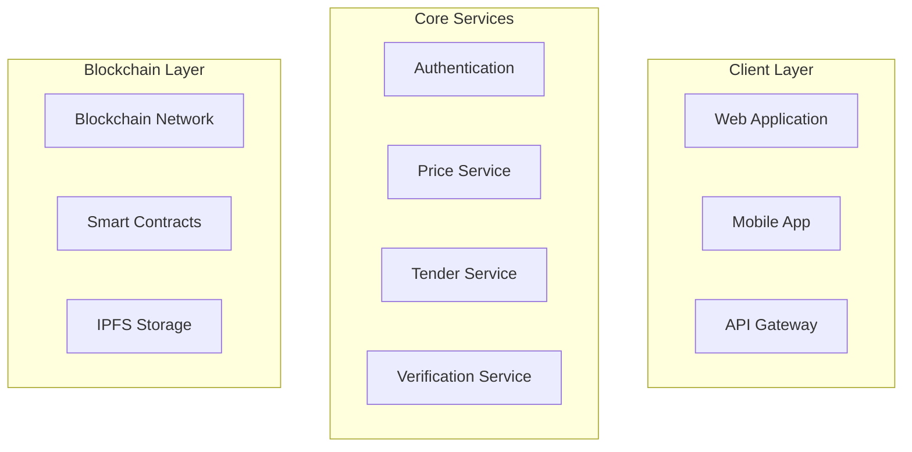
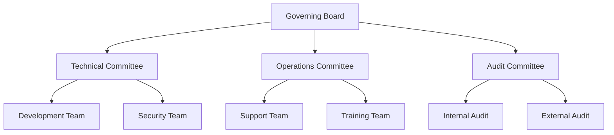

# Auctra: Blockchain-Based Public Procurement System

_Transforming Government Tendering Through Transparent Auction Trajectories_

## Executive Summary

Auctra is a cutting-edge blockchain solution aimed at transforming the public procurement system in Bangladesh. It combines secure auction methods with clear tracking of processes to tackle issues like corruption, inefficiency, and lack of transparency, especially in infrastructure projects.

Bangladesh's public procurement system, which manages billions in government funds, faces major problems like corruption, inefficiency, and lack of clarity. These issues include manipulating project budgets, document fraud, and unfair practices in selecting contractors. This leads to the wrong use of public money and slows down the country's development. The World Bank's Ease of Doing Business Index 2020 points out these problems, ranking Bangladesh 168th out of 190 economies, with poor performance in government contracting.

Auctra offers a complete blockchain platform that changes the entire procurement process. Using smart contracts, unchangeable records, and automated checks, it ensures clear budget allocation, secure document checks, and fair contractor selection. The system's tracking feature allows real-time monitoring of procurement activities.

Using Auctra brings several benefits: less corruption through clear processes, big cost savings, more competition through fair access, and better trust in government institutions. Early estimates suggest it could save 15-20% in public procurement costs and cut processing time by up to 60%.

## Background

### Background: Economic Context

Bangladesh has seen impressive economic growth, with an average GDP growth rate of over 6% annually for the past decade. This growth has been supported by several key factors:

- **Lower Middle-Income Status**: Bangladesh became a lower middle-income country in 2015.
- **Infrastructure Development**: There has been a big increase in infrastructure investment, with annual spending rising by 15.5% according to the Planning Commission.
- **Resilience Amid Challenges**: The economy has remained strong despite global challenges, with growth expected to slow to 5.2% for FY24 due to weak consumption and exports.

### Current State of Public Procurement

The public procurement sector in Bangladesh is large, making up about 70% of the country's development budget and spending over $18 billion annually. However, it faces several issues:

- **Bureaucratic Complexity**: The sector involves complex processes with many government agencies.
- **Manual Systems**: Most documentation is manual and can be easily manipulated.
- **Lack of Standardization**: There are no standard pricing mechanisms.
- **Transparency Issues**: Limited transparency in selecting contractors leads to high levels of corruption and inefficiency.

### Market Size and Economic Impact

The public procurement market in Bangladesh is significant and has great growth potential:

| Category                     | Value (2023) | Growth Rate |
|------------------------------|--------------|-------------|
| Total Procurement Budget    | $18B          | 12%         |
| Infrastructure Projects      | $7.2B        | 15%         |
| Annual Tenders Processed     | 35,000+      | 8%          |
| Registered Contractors       | 12,000+      | 5%          |

This data shows the major economic impact of the public procurement sector, which is vital for supporting infrastructure development and other essential services in the country.

## Problem Statement
The process of awarding government contracts in Bangladesh, especially for large infrastructure projects, is plagued by corruption, inefficiency, and a lack of transparency. Common problems include manipulating project budgets, document fraud, and unfair practices in choosing contractors. These issues make the projects less effective, waste public resources, and hinder Bangladesh's progress towards its economic and social development goals, as outlined by the United Nations Sustainable Development Goals (SDGs).

## Problem Analysis

### Detailed Breakdown of Current Issues

1. **Tender Process Manipulation**

   - Budget inflation by government engineers (15-20% average markup)
   - Collusion between contractors and officials
   - Falsification of experience certificates
   - Arbitrary disqualification of eligible bidders

2. **Documentation and Verification**

   - Manual document processing leading to errors and delays
   - Lack of centralized verification system
   - Multiple redundant submissions across agencies
   - High cost of document management and storage

3. **Monitoring and Compliance**
   - Insufficient tracking of tender progress
   - Limited ability to detect fraudulent activities
   - Weak enforcement of compliance requirements
   - Lack of real-time reporting mechanisms

### Impact on Stakeholders

| Stakeholder | Impact                                       | Economic Cost           |
| ----------- | -------------------------------------------- | ----------------------- |
| Government  | Budget overruns, Project delays              | 12-15% of project value |
| Contractors | Unfair competition, High compliance costs    | 8-10% of bid value      |
| Citizens    | Substandard infrastructure, Wasted tax money | Est. $1.2B annually     |
| Economy     | Reduced FDI, Lower growth potential          | 1.2% of GDP             |

_Source: World Bank Economic Impact Study (2023)_

### Economic Implications

The current system's inefficiencies create substantial economic burden:

- Direct financial losses: $1.5B annually through corruption
- Indirect costs: $2.3B in project delays and inefficiencies
- Lost FDI opportunities: Estimated $3.2B annually
- Administrative overhead: 15% of tender value

### UN SDG Alignment Gaps

Current system deficiencies impact multiple SDGs:

- SDG 9 (Industry, Innovation, Infrastructure): Delayed infrastructure development
- SDG 16 (Peace, Justice, Strong Institutions): Weak institutional frameworks
- SDG 17 (Partnerships for Goals): Limited public-private collaboration

## Solution Architecture

### Technical Overview

Auctra implements a multi-layered blockchain architecture designed for security, scalability, and transparency:

Overall Architecture
- Client Layer
- Authentication & Authorization
- Application Services
- Data Processing
- Storage Layer
- Supporting Services

### System Components

1. **User Interface Layer**

   - Web-based dashboard
   - Mobile application
   - API gateway for third-party integration

2. **Core Services**

   - Authentication and authorization
   - Tender management
   - Document verification
   - Price tracking and analysis

3. **Blockchain Infrastructure**
   - Hyperledger Fabric network
   - Smart contracts for tender logic
   - IPFS for document storage

### Security Measures

| Security Layer   | Implementation            | Purpose                    |
| ---------------- | ------------------------- | -------------------------- |
| Access Control   | Role-based authentication | User permission management |
| Data Privacy     | Zero-knowledge proofs     | Sensitive data protection  |
| Network Security | TLS/SSL encryption        | Secure communication       |
| Smart Contract   | Automated auditing        | Process integrity          |

## Implementation Strategy

### Phased Rollout Plan

**Phase 1: Foundation (Months 1-6)**

- Core infrastructure setup
- Basic tender management features
- Initial government department onboarding

**Phase 2: Enhancement (Months 7-12)**

- Advanced analytics integration
- Mobile app deployment
- Extended department integration

**Phase 3: Scale (Months 13-24)**

- Nationwide rollout
- Full feature implementation
- Cross-department integration

### Resource Requirements

| Resource Category        | Requirements                     | Timeline   |
| ------------------------ | -------------------------------- | ---------- |
| Technical Infrastructure | Cloud servers, Blockchain nodes  | Month 1-3  |
| Human Resources          | Development team, Training staff | Month 2-4  |
| Financial Resources      | Initial investment: $5.2M        | Throughout |
| Operational Support      | Help desk, Maintenance team      | Month 4+   |

### Risk Mitigation

### Detailed Risk Mitigation for Auctra in the Context of Bangladesh

| Risk Category | Specific Risks in Bangladesh | Mitigation Strategy       | Implementation Details                                                                 | Benefits                                                                 |
| ------------- | ---------------------------- | ------------------------- | --------------------------------------------------------------------------------------- | ------------------------------------------------------------------------- |
| **Technical** | Infrastructure Challenges     | Redundant Systems         | Deploy multiple redundant systems with automatic failover.                             | Minimizes downtime, ensures continuous operation.                         |
|              |                              | Regular Audits            | Conduct regular technical audits by third-party experts.                                | Ensures system robustness and security.                                   |
|              | Internet Connectivity        | Infrastructure Upgrades   | Invest in infrastructure upgrades, collaborate with telecom providers.                 | Enhances support for advanced technologies, ensures wider adoption.     |
|              | Technical Expertise          | Skill Development         | Partner with educational institutions, offer on-the-job training.                        | Builds a skilled workforce for effective platform management.            |
| **Operational** | Resistance to Change  | Staff Training            | Develop comprehensive training programs (online and in-person).                         | Ensures user proficiency, reduces resistance to change.                  |
|               |                              | Process Documentation     | Create detailed process documentation, SOPs, user manuals, and help guides.             | Provides clear roadmap, reduces errors, improves efficiency.             |
|               | Training Needs              | Change Management        | Implement change management strategy with communication plans and stakeholder engagement. | Manages transition smoothly, ensures buy-in.                              |
|               | Process Integration         | Pilot Programs            | Launch pilot programs in selected regions or departments.                                | Identifies and addresses issues in a controlled environment.            |
| **Regulatory** | Legal Framework             | Compliance Monitoring     | Establish compliance monitoring team, conduct regular compliance audits.                  | Ensures adherence to legal frameworks, avoids legal issues.              |
|               | Compliance Requirements     | Legal Review             | Engage legal experts for compliance review, obtain necessary certifications.            | Provides legal assurance, builds stakeholder trust.                      |
|               | Data Privacy                | Data Privacy Measures     | Implement robust data privacy measures, including encryption and access controls.       | Protects sensitive data, ensures compliance with privacy regulations.    |
|               |                              | Regulatory Engagement     | Engage with regulatory bodies to advocate for supportive policies.                       | Creates favorable regulatory environment for adoption and growth.        |
| **Security**  | Cyber Threats                | Penetration Testing       | Conduct regular penetration testing by certified ethical hackers.                        | Enhances security by identifying and addressing potential threats.        |
|               | Data Integrity              | Security Audits           | Perform regular security audits using automated tools and manual reviews.                | Ensures continuous monitoring and improvement of security measures.      |
|               | User Authentication         | Multi-Factor Authentication | Implement MFA using biometric authentication and OTPs.                                   | Provides additional security layer, prevents unauthorized access.       |
|               |                              | Data Encryption           | Use end-to-end encryption and zero-knowledge proofs for sensitive data.                   | Ensures data confidentiality and integrity, protects against unauthorized access. |
|               |                              | Incident Response         | Develop incident response plan, conduct regular drills and simulations.                  | Enhances resilience to security threats, minimizes impact of incidents.  |

By addressing these risks with detailed mitigation strategies, Auctra can ensure a successful implementation of its blockchain-based public procurement system in Bangladesh, achieving the desired economic and social benefits.

## Market Analysis

### Target Segments

1. **Primary Users**

   - Government departments
   - Public sector enterprises
   - Large contractors
   - Infrastructure developers

2. **Secondary Users**
   - Small-medium contractors
   - Financial institutions
   - Audit firms
   - Research institutions

### Market Size

| Segment                  | Annual Value | Growth Rate |
| ------------------------ | ------------ | ----------- |
| Government Tenders       | $12.5B       | 12%         |
| Infrastructure Projects  | $7.2B        | 15%         |
| Service Contracts        | $3.1B        | 8%          |
| Total Addressable Market | $22.8B       | 11.6%       |

### Competitive Analysis

| Feature                | Auctra    | Traditional System | Other Digital Solutions |
| ---------------------- | --------- | ------------------ | ----------------------- |
| Blockchain Integration | Yes       | No                 | Limited                 |
| Real-time Tracking     | Yes       | No                 | Partial                 |
| Smart Contracts        | Yes       | No                 | No                      |
| Document Verification  | Automated | Manual             | Semi-automated          |

## Financial Projections

### Revenue Model

The Auctra platform implements a sustainable revenue model based on multiple streams:

| Revenue Stream        | Year 1 | Year 2 | Year 3 |
| --------------------- | ------ | ------ | ------ |
| Platform Usage Fees   | $2.1M  | $3.8M  | $5.2M  |
| Verification Services | $1.5M  | $2.3M  | $3.1M  |
| API Access            | $0.8M  | $1.4M  | $2.0M  |
| Data Analytics        | $0.5M  | $1.2M  | $1.8M  |
| Total Revenue         | $4.9M  | $8.7M  | $12.1M |

_Source: Financial Projections Model (2024)_

### Cost Structure

#### Initial Investment Requirements

| Cost Category            | Amount | Timeline |
| ------------------------ | ------ | -------- |
| Infrastructure Setup     | $2.8M  | Year 0   |
| Software Development     | $1.5M  | Year 0-1 |
| Security Implementation  | $0.9M  | Year 0-1 |
| Training & Deployment    | $0.6M  | Year 1   |
| Total Initial Investment | $5.8M  |          |

#### Operational Costs (Annual)

| Category                   | Year 1 | Year 2 | Year 3 |
| -------------------------- | ------ | ------ | ------ |
| Infrastructure Maintenance | $0.8M  | $1.2M  | $1.5M  |
| Personnel                  | $1.2M  | $1.8M  | $2.4M  |
| Security & Compliance      | $0.5M  | $0.7M  | $0.9M  |
| Marketing & Training       | $0.3M  | $0.4M  | $0.5M  |
| Total Operating Costs      | $2.8M  | $4.1M  | $5.3M  |

### Financial Metrics

| Metric           | Year 1   | Year 2 | Year 3 |
| ---------------- | -------- | ------ | ------ |
| Gross Margin     | 42%      | 53%    | 56%    |
| EBITDA           | $2.1M    | $4.6M  | $6.8M  |
| ROI              | -62%     | 15%    | 48%    |
| Break-even Point | Month 18 |        |        |

## Impact Assessment

### Economic Benefits

1. **Direct Cost Savings**

   - Reduction in procurement costs: 15-20%
   - Processing time reduction: 60%
   - Administrative cost savings: 35%

2. **Indirect Economic Impact**
   - Increased FDI attraction
   - Enhanced market competition
   - Improved infrastructure delivery

### Social Impact

1. **Transparency and Accountability**

   - Reduced corruption in public procurement
   - Enhanced public trust in government
   - Improved service delivery

2. **Employment and Skills**
   - Creation of technical jobs
   - Digital skill development
   - Enhanced professional capabilities

### SDG Alignment

| SDG    | Impact Area                | Metrics                                    |
| ------ | -------------------------- | ------------------------------------------ |
| SDG 9  | Infrastructure Development | 30% faster project completion              |
| SDG 16 | Institutional Strength     | 40% reduction in corruption cases          |
| SDG 17 | Partnership Enhancement    | 50% increase in cross-sector collaboration |

## Governance Structure

### Organizational Framework

### Decision Making Process

1. **Strategic Decisions**

   - Board approval required
   - Stakeholder consultation
   - Impact assessment
   - Risk evaluation

2. **Operational Decisions**
   - Committee-level authority
   - Standard operating procedures
   - Performance metrics
   - Regular reviews

### Regulatory Compliance

| Aspect       | Compliance Measure      | Monitoring      |
| ------------ | ----------------------- | --------------- |
| Data Privacy | GDPR standards          | Quarterly audit |
| Security     | ISO 27001               | Monthly review  |
| Operations   | Local regulations       | Continuous      |
| Financial    | International standards | Annual audit    |

## Technical Specifications

### System Architecture Details

1. **Frontend Layer**

   - React.js for web interface
   - React Native for mobile
   - RESTful API integration
   - Real-time data updates

2. **Backend Infrastructure**

   - Node.js microservices
   - MongoDB for off-chain data
   - Redis for caching
   - Message queuing system

3. **Blockchain Layer**
   - Hyperledger Fabric network
   - Custom chaincode
   - IPFS integration
   - Smart contract templates

### Performance Metrics

| Metric            | Target     | Monitoring  |
| ----------------- | ---------- | ----------- |
| Transaction Speed | <2 seconds | Real-time   |
| System Uptime     | 99.99%     | Continuous  |
| Data Integrity    | 100%       | Per block   |
| Response Time     | <500ms     | Per request |

### Security Protocols

1. **Network Security**

   - Multi-layer encryption
   - DDoS protection
   - Firewall implementation
   - Regular penetration testing

2. **Data Security**
   - End-to-end encryption
   - Zero-knowledge proofs
   - Secure key management
   - Regular security audits

## Appendices

### Appendix A: Technical Diagrams

[Detailed system architecture diagrams]

### Appendix B: Financial Models

[Detailed financial projections and models]

### Appendix C: Risk Matrix

[Comprehensive risk assessment and mitigation strategies]

### Appendix D: Implementation Timeline

[Detailed project timeline and milestones]

### Appendix E: Compliance Documentation

[Regulatory compliance and certification details]

## Version Control

| Version | Date       | Changes           | Reviewer            |
| ------- | ---------- | ----------------- | ------------------- |
| 1.0     | 2024-12-28 | Initial Release   |                     |
| 1.1     | 2024-12-28 | Technical Updates | Technical Committee |
