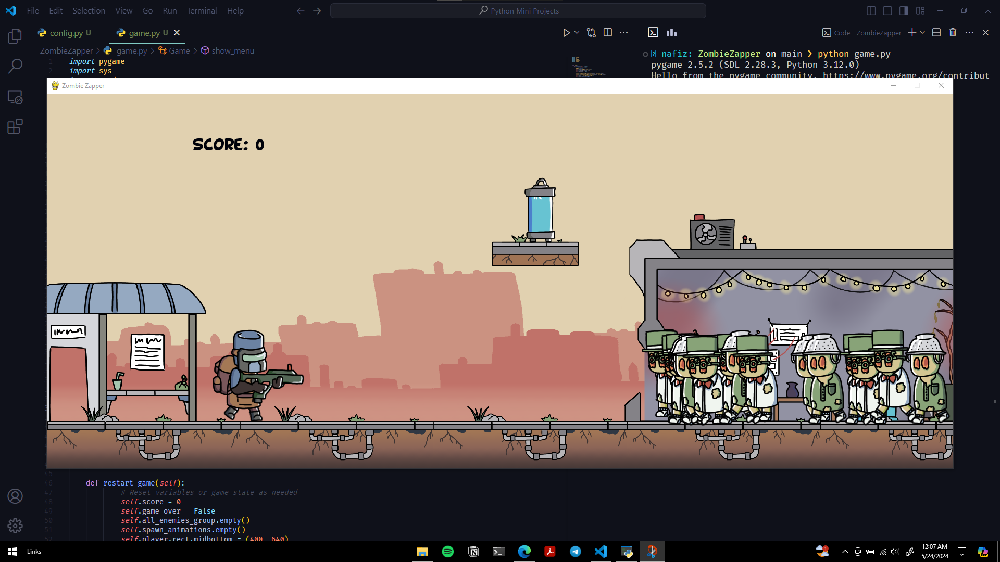

# Zombie Zapper

Zombie Zapper is an exciting 2D platformer game where you battle hordes of zombies in a post-apocalyptic world. With simple controls and addictive gameplay, it offers hours of fun and excitement!

## How to Play

1. **Controls:**
   - Use arrow keys to move left and right.
   - Press spacebar to jump.
   - Press 'F' to shoot.
   - Press 'P' for restart
2. **Objective:**
   - Reach the end of each level while defeating zombies and avoiding obstacles.

## Installation

1. Clone the repository.
2. Install dependencies with `pip install pygame`.
3. Run the game with `python game.py`.

## Credits

- Game by ahammadnafiz
- Artwork: [Credits](https://itch.io/queue/c/2542235/pygame-assets?game_id=1181927)
